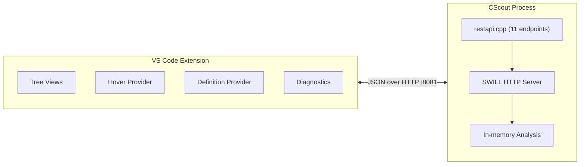

# vscode-cscout

A VS Code extension that surfaces CScout's whole-program C analysis inside the editor. Connects to a running CScout process via a JSON REST API and presents results through native VS Code UI.

## Screenshots

**Project Explorer and Diagnostics**


**Identifier Browser** (Functions, Macros, Typedefs, Struct/Union Tags, Members, Variables)


**Call Graph** (expandable callers/callees tree with lazy loading)


**File Metrics**


**Hover Tooltip and Identifier Locations**


**Go-to-Definition** (scored by workspace proximity and header preference)


**Diagnostics** (unused identifiers from CScout's whole-program analysis)


## Demo Video

[](https://www.youtube.com/watch?v=eaO7j1sIIhA)

## How It Works



1. Run CScout on your C project (`cscout your-workspace.cs`). It starts listening on port 8081.
2. Open the project folder in VS Code.
3. Run **CScout: Connect to Server** from the command palette.
4. The extension probes `/api/projects`. If the REST API exists, it loads data into the sidebar. If not, it falls back to HTML scraping.

## Features

| Feature | Description |
|---|---|
| Project Explorer | Browse projects and their files in a tree view |
| File Metrics | Per-file metrics (lines, statements, tokens, complexity, etc.) |
| Identifier Browser | All identifiers grouped by kind, with clickable source locations |
| Call Graph | Expandable callers/callees tree with lazy loading from server |
| Hover Tooltips | Identifier kind, unused status, equivalence class ID |
| Go-to-Definition | F12 / Ctrl+Click with multi-factor scoring (workspace proximity, header preference) |
| Diagnostics | Unused identifiers surfaced in the Problems panel |
| HTML Fallback | Works with stock CScout installations (no REST API needed) |

## REST API Endpoints

Implemented in `restapi.cpp` on the [`feat/rest-api`](https://github.com/sanki92/cscout/tree/feat/rest-api) branch. Collection endpoints return paginated envelopes: `{"total": N, "items": [...]}`.

| Endpoint | Returns |
|---|---|
| `GET /api/projects` | All projects |
| `GET /api/project_files?pid=N` | Files in project N |
| `GET /api/files` | All files. Filters: `writable`, `pid`, `limit`, `offset` |
| `GET /api/filemetrics?fid=N` | Per-file metrics |
| `GET /api/identifiers` | All identifiers. Filters: `unused`, `writable`, `limit`, `offset` |
| `GET /api/identifier?eid=N` | Single identifier + all token locations |
| `GET /api/functions` | All functions. Filters: `defined`, `limit`, `offset` |
| `GET /api/function?id=N` | Single function details |
| `GET /api/function_callers?id=N` | Callers of function N |
| `GET /api/function_callees?id=N` | Callees of function N |
| `GET /api/source?fid=N` | Source lines as JSON array |

## Setup

```bash
cd vscode-cscout
npm install
npm run compile
```

### Mock server

```bash
npm run server          # Terminal 1: starts mock on :8081
code --extensionDevelopmentPath="$(pwd)"  # Terminal 2: dev window
```

Then run **CScout: Connect to Server**. The mock loads `sample/sample-cscout.db` (a small arithmetic calculator project).

### Real CScout

```bash
git clone https://github.com/sanki92/cscout && cd cscout
git checkout feat/rest-api
make
cd example && ../src/build/cscout awk.cs
```

Then connect from VS Code. Cygwin (`/cygdrive/f/...`) and WSL (`/mnt/f/...`) paths are automatically normalized to Windows paths.

### Tests

```bash
npm test   # ~50 tests: DB layer, HTTP client, REST endpoint contracts
```

## Project Structure

### CScout C++ (REST API layer)

```
src/
├── restapi.h          # Declares rest_api_register()
├── restapi.cpp        # 11 endpoint handlers, ID maps, JSON helpers
├── cscout.cpp         # +1 include, +1 function call
└── Makefile           # +restapi.o in link step
```

SWILL CRLF fix (6 lines) committed separately: [sanki92/swill fix/crlf-http-headers](https://github.com/sanki92/swill/tree/fix/crlf-http-headers).

### VS Code Extension

```
vscode-cscout/
├── package.json
├── src/
│   ├── extension.ts           # Entry point, commands, paged loading
│   ├── services/
│   │   └── cscoutServer.ts    # HTTP client (HTTP-first, TCP fallback)
│   ├── db/
│   │   └── cscoutDatabase.ts  # sql.js/WASM SQLite for mock + tests
│   ├── providers/
│   │   ├── definitionProvider.ts   # F12 / Ctrl+Click
│   │   ├── diagnosticsProvider.ts  # Unused identifiers in Problems panel
│   │   └── hoverProvider.ts        # Hover tooltips
│   ├── views/
│   │   ├── projectsTree.ts    # Projects -> files tree
│   │   ├── metricsTree.ts     # Per-file metrics
│   │   ├── identifiersTree.ts # Identifiers grouped by kind
│   │   └── callGraphTree.ts   # Callers/callees tree
│   ├── scripts/
│   │   ├── mockServer.ts      # Mock HTTP server (dev/test only)
│   │   └── generateSampleDb.ts
│   └── test/                  # ~50 tests across 3 suites
└── sample/
    ├── calc/                  # Sample C project
    └── sample-cscout.db
```

## Design Decisions

**Separate module.** All endpoints live in `restapi.cpp`. The only change to `cscout.cpp` is one `#include` and one call to `rest_api_register()`.

**Stable integer IDs.** CScout uses `Eclass*` and `Call*` pointers internally. The REST API assigns sequential integers via `build_id_maps()`, stable for the process lifetime. Guarded by a static boolean flag to ensure single initialization.

**Stateless project scoping.** The web UI sets a global `current_project` server-side. The REST API uses `?pid=N` per request instead, so concurrent clients don't interfere.

**Paginated envelopes.** Collection endpoints return `{"total": N, "items": [...]}` with `?limit=N&offset=M` parameters. The client knows the full result size upfront.

**Separate endpoints per resource.** `/api/function` returns details, `/api/function_callers` and `/api/function_callees` return call graph edges. No overloaded response shapes.

**SWILL CRLF fix.** SWILL used `\n` in HTTP headers; RFC 7230 requires `\r\n`. Fixed in [sanki92/swill](https://github.com/sanki92/swill/tree/fix/crlf-http-headers). The extension uses HTTP-first transport with a raw TCP fallback for unpatched SWILL installations.

**HTML fallback.** If `/api/projects` doesn't exist (stock CScout), the extension falls back to scraping HTML pages.

**Path normalization.** CScout under Cygwin/WSL returns `/cygdrive/f/...` or `/mnt/f/...` paths. Normalized to Windows drive paths automatically.

**Input validation.** Every endpoint validates ID parameters and returns `400`/`404` with a JSON error body.

**RFC 8259 JSON escaping.** `json_escape()` covers the full U+0000..U+001F control range.
